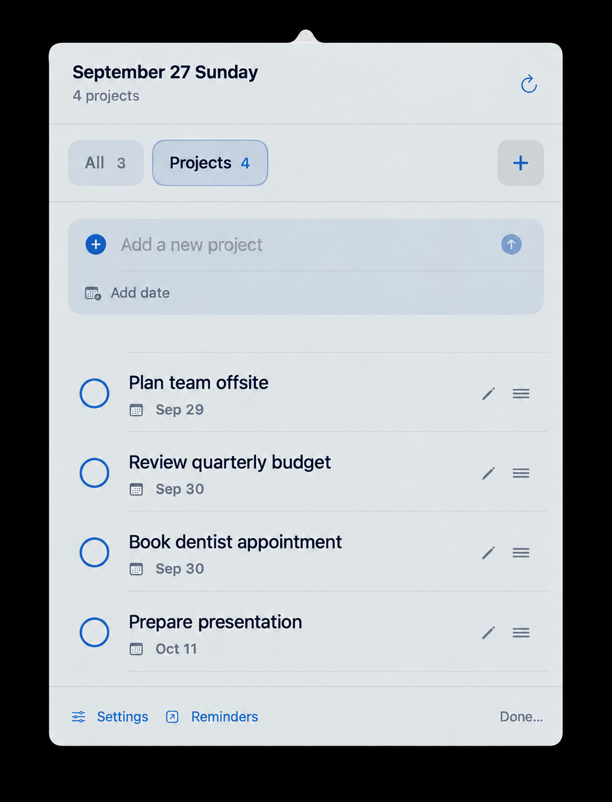

# BarRemember

<p align="center">
  
</p>

<p align="center">
  A quiet, native macOS menu bar companion for Apple Reminders.
</p>

<p align="center">
  <a href="https://github.com/angellashin/Bar-Remember/actions"></a>
  <a href="https://github.com/angellashin/Bar-Remember/issues"></a>
  <a href="https://github.com/angellashin/Bar-Remember"></a>
  
  
</p>



## Why BarRemember?

Apple Reminders is excellent for capture, but opening the full app can interrupt a focused workflow. BarRemember keeps a small, keyboard-friendly view in the menu bar so the lists you check most often are always one click away.

It is intentionally focused: no account, no server, no analytics, and no replacement for Reminders. It is a local companion that reads and updates the Reminders database already on your Mac.

## Highlights

- Native SwiftUI/AppKit menu bar app with no Dock icon.
- Connect any Reminders list to a custom space such as Work, Study, Applications, or anything you choose.
- Complete an item directly from the popover, with a short undo action when you clicked by mistake.
- Add, edit, reorder, and delete due dates without opening the full Reminders app.
- Detect clear date suffixes such as `CJ application deadline 9/28` or `Send proposal tomorrow` using deterministic rules, not AI.
- Choose a completion-circle color and switch between System, Paper, Glass, and Midnight themes.
- Glass uses translucent materials, layered color fields, and a light border so the background remains visible.
- English and Korean UI with a language switch in Settings.
- Optional launch-at-login support.

## Requirements

- macOS 14 Sonoma or later
- Apple Reminders enabled in iCloud (recommended for sync across devices)
- Swift 6.2 or Xcode 16.4+ to build from source

BarRemember requests Reminders access through EventKit on first launch. The app does not upload reminder data or require a separate service account.

## Install from source

```sh
git clone https://github.com/angellashin/Bar-Remember.git
cd Bar-Remember
chmod +x Scripts/build-app.sh
Scripts/build-app.sh
open dist/BarRemember.app
```

The script creates a signed-for-local-use app at `dist/BarRemember.app`. macOS may ask you to approve Reminders access in **System Settings → Privacy & Security → Reminders**.

For development, open the repository in Xcode or run the test suite with the Xcode toolchain:

```sh
swift test
```

## How it works

1. EventKit reads incomplete reminders and their due dates from the selected lists.
2. BarRemember groups connected lists into user-named spaces and stores that mapping in `UserDefaults`.
3. Manual ordering is stored locally because EventKit does not expose an arbitrary custom order for Reminders items.
4. Changes made in BarRemember are written back to Apple Reminders immediately.

The date parser is a small, predictable rules engine. It recognizes explicit numeric dates (`9/28`, `2026-09-28`) and a small set of relative words in Korean and English. It does not call an AI model.

## Localization

The shipped UI supports:

- Korean
- English (`English`)

Choose a language from **Settings → Language**. Contributions that add or revise copy should update both `Resources/ko.lproj/Localizable.strings` and `Resources/en.lproj/Localizable.strings`.

## Privacy

BarRemember is local-first. Reminder titles, dates, completion state, and list connections stay on the Mac and are accessed through Apple’s EventKit framework. There is no telemetry, advertising SDK, remote database, or BarRemember account.

Deleting a BarRemember space only removes the local connection. It does not delete the linked Reminders list or its items.

## Contributing

Issues and pull requests are welcome. Please read [CONTRIBUTING.md](CONTRIBUTING.md) before opening a change. Small, focused pull requests are easiest to review; include screenshots for UI changes and add or update tests for behavior changes.

Use the issue templates for bug reports and feature requests. Please do not include private reminder titles or screenshots containing personal information.

## Project status

BarRemember is an early open-source MVP. The core workflow is stable, but the visual language, accessibility coverage, and localization will continue to improve. See the issue tracker for current work and proposed ideas.

## License

BarRemember is released under the [MIT License](LICENSE). You are free to use, modify, and redistribute it under the terms of that license.

## Acknowledgements

Built with SwiftUI, AppKit, EventKit, and SF Symbols. The logo and interface direction are maintained in [`DESIGN.md`](DESIGN.md).
